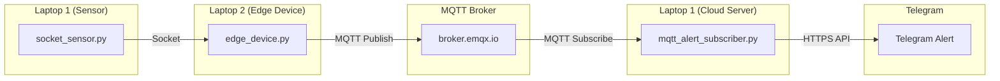

# Wireless and Radiotechnology Course 2026: MQTT and Telegram Alert System

## Objective
This project extends an IoT system by adding a real-time alert system using Telegram. When the temperature received from a sensor exceeds a specified threshold (e.g., 28°C), the system sends an automated notification to a Telegram bot.

## System Architecture
The system consists of three main components communicating via Socket and MQTT protocols:

### Data Flow:
1. **Sensor (Laptop 1):** `socket_sensor.py` generates random temperature data and sends it to the Edge Device via a TCP socket.
2. **Edge Device (Laptop 2):** `edge_device.py` listens for socket data, receives it, and publishes it to the MQTT broker.
3. **Cloud Server (Laptop 1):** `mqtt_alert_subscriber.py` subscribes to the MQTT topic. If the temperature exceeds the threshold (28°C), it triggers a Telegram notification.
4. **Telegram Alert:** The notification is sent via the Telegram Bot API to the user's chat.

## Configuration
- **MQTT Broker:** `broker.emqx.io`
- **MQTT Topic:** `savonia/iot/temperature`
- **Socket Port:** `5000`
- **Temperature Threshold:** `28°C`

## How it Works
1. **Socket Communication:** The sensor and edge device communicate over a local network (or localhost for testing) using standard TCP sockets. This is efficient for point-to-point data transfer.
2. **MQTT Protocol:** The edge device acts as an MQTT publisher. MQTT is ideal here because it allows the "Cloud Server" to be decoupled from the edge device; the server just needs to know the broker and topic.
3. **Telegram Integration:** Using the `requests` library, the subscriber script sends a POST request to the Telegram Bot API. This bridges the IoT system with a real-world messaging platform for instant alerts.

## Reflection Question
**Why is MQTT useful for building monitoring and alert systems in IoT?**

MQTT is particularly useful because of its **Publish/Subscribe model**, which decouples the data producer (sensor/edge device) from the data consumer (alert system/dashboard). This allows for easy scalability—multiple subscribers can listen for the same alert without adding load to the sensor. Additionally, its **lightweight header** and **low bandwidth requirements** make it perfect for IoT devices that may have limited power or unreliable network connections.

## How to Run
1. Start the Alert Subscriber: `python mqtt_alert_subscriber.py`
2. Start the Edge Device: `python edge_device.py`
3. Start the Sensor: `python socket_sensor.py`
